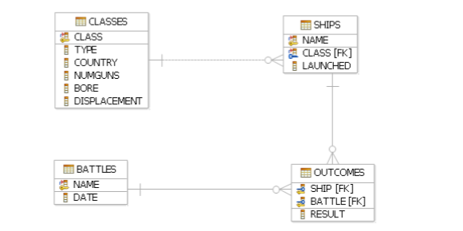
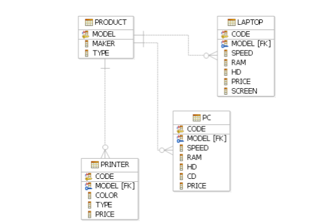

# JOIN, LEFT JOIN, GROUP BY, HAVING

Presentation: http://slides.com/hackbulgaria/sql-queries-and-join-115

## Заявки за базата от данни Movies

• Напишете заявка, която извежда името на актьора и годината на първия филм, в който е участвал.

• Напишете заявка, която извежда името на актьора и на колко години е бил когато е направил дебюта си.

• Напишете заявка, която извежда името на студиото, адреса на студиото и средната дължина на филмите направени в него.

## За базата от данни SHIPS

•Напишете заявка, която за всеки кораб извежда името му, държавата, броя
оръдия и годината на пускане (launched).

•Повторете горната заявка като този път включите в резултата и класовете, които
нямат кораби, но съществуват кораби със същото име като тяхното.

• Напишете заявка, която извежда имената на корабите, участвали в битка от 1942г.

• За всяка страна изведете имената на корабите, които никога не са участвали в битка.

## За базата от данни PC

• Напишете заявка, която извежда средната скорост на компютрите

• Напишете заявка, която извежда средния размер на екраните на лаптопите за
всеки производител.

• Напишете заявка, която извежда средната скорост на лаптопите с цена над 1000.

• Напишете заявка, която извежда средната цена на компютрите според различните им hd.

• Напишете заявка, която извежда средната цена на компютрите за всяка скорост по-голяма от 500.

• Напишете заявка, която извежда средната цена на компютрите произведени от производител ‘A’.

• Напишете заявка, която извежда средната цена на компютрите и лаптопите за производител ‘B’

• Напишете заявка, която извежда производителите, които са произвели поне по 3 различни модела компютъра. Помислете каква заявка можете да напишете за да сте сигурни в отговора, например да изведете за всеки производител, броя различни модели компютри.

• Напишете заявка, която извежда производителите на компютрите с най-висока цена.

•Напишете заявка, която извежда средния размер на диска на тези компютри произведени от производители, които произвеждат и принтери.
